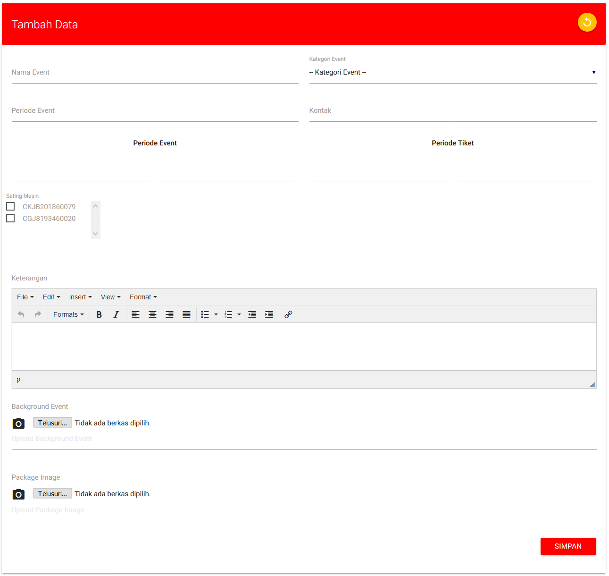

# Input Data - Event

Form input data event terdiri dari berbagai macam field untuk di isi.

* **Nama Event :** Memberikan nama event yang akan dibuat
* **Kategori Event :** Memilih salah satu jenis kategori yang sesuai untuk event yang akan dibuat
* **Periode Event :** Penentuan **`tanggal periode event`** yang akan dibuat \(Ex: 1 Januari 2021 - 31 Januari 2021\)
* **Periode Tiket :** Penentuan **`tanggal periode tiket`** yang akan dibuat \(Ex: 1 Januari 2021 - 20 Januari 2021\)
* **Setting Mesin :** Memilih mesin yang akan digunakan di dalam event
* **Keterangan :** Membuat isi dan juga penjelasan dari event yang akan di buat dan dilaksanakan.
* **Background Event :** Memberikan gambar konten event yang akan di tampilkan ke halaman beranda front-end
* **Package Image :** Memberikan gambar paket untuk pilihan paket yang akan disediakan untuk anggota yang akan membeli tiket pada event tersebut

