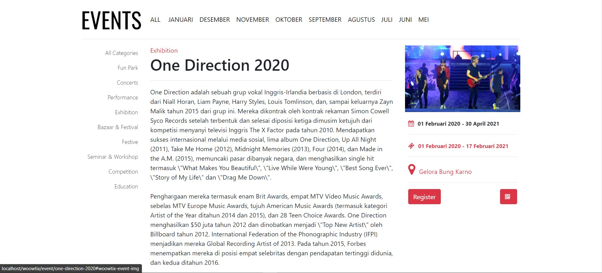
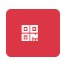

# Detail Event

Halaman **Detail Event** adalah halaman yang terdapat pada website front-end **WooWtix.** Menampilkan detail dari event yang dipilih.

Di dalam halaman **Detail Event**, kita dapat melihat _**Category**_ yang telah tersedia pada sisi kiri halaman.

Isi konten \(detail event\) pada tengah halaman, dan juga _**button**_   yang berguna untuk mendaftarkan diri, atau juga bisa mendaftarkan diri melalui barcode dengan klik _**button**_   

